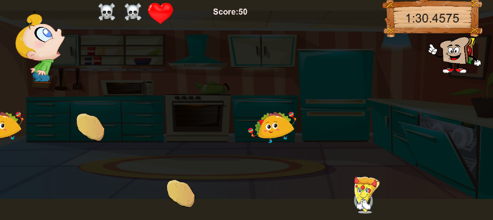
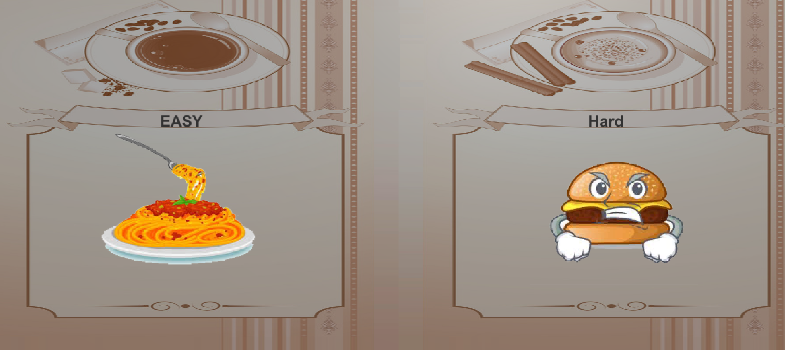
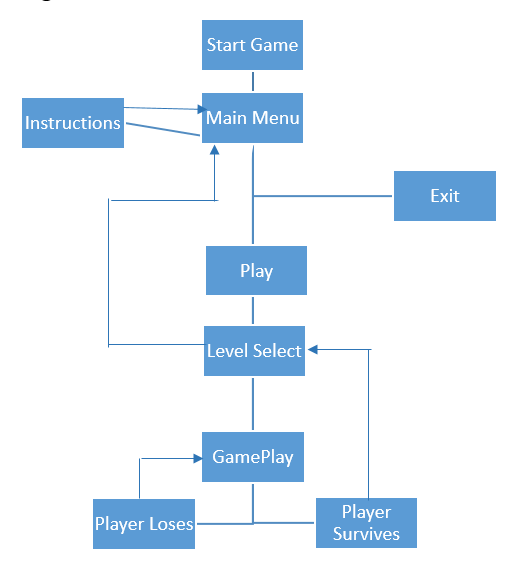

# Eating-Healthy-Game
> An Educational Game build in unity aimed at helping toddlers understand the value of eating healthy by avoiding junk food and choosing green vegetables

---

### Table Of Contents
- [Description](#description)
- [License](#license)
- [About](#about)
- [Author Info](#author-info)

---

## Description
A 2D game where the user has a restricted control over the protagonist. The user can only move the character up or down while a variety of different food will be making their way to him. The main objective will be to feed Jeff fruits and vegetables and save him from the junk food. The user will have save Jeff for a two minutes after which they will complete the game. The user will also get scored on the basis of the number of healthy items which are fed to Jeff. To achieve this the user will have to move Jeff up or down the three lanes accordingly.

### Technologies

- Unity
- C#

---
## License
MIT License

Copyright (c) 2020 Gursimar Singh Bedi

Permission is hereby granted, free of charge, to any person obtaining a copy of this software and associated documentation files (the "Software"), to deal in the Software without restriction, including without limitation the rights to use, copy, modify, merge, publish, distribute, sublicense, and/or sell copies of the Software, and to permit persons to whom the Software is furnished to do so, subject to the following conditions:

The above copyright notice and this permission notice shall be included in all copies or substantial portions of the Software.

THE SOFTWARE IS PROVIDED "AS IS", WITHOUT WARRANTY OF ANY KIND, EXPRESS OR IMPLIED, INCLUDING BUT NOT LIMITED TO THE WARRANTIES OF MERCHANTABILITY, FITNESS FOR A PARTICULAR PURPOSE AND NONINFRINGEMENT. IN NO EVENT SHALL THE AUTHORS OR COPYRIGHT HOLDERS BE LIABLE FOR ANY CLAIM, DAMAGES OR OTHER LIABILITY, WHETHER IN AN ACTION OF CONTRACT, TORT OR OTHERWISE, ARISING FROM, OUT OF OR IN CONNECTION WITH THE SOFTWARE OR THE USE OR OTHER DEALINGS IN THE SOFTWARE.

---

## About
 ### Scenes
There are 4 different scenes. First scene will be the main menu with Start, Instructions and Exit buttons. Exit button will close the game. Instruction button will lead to instructions page and start will take to level select which will eventually take user to the actual game. 
 ### Game controls
 Keeping in mind that the target audience is toddlers, the controls are as simple as possible. Just two controls:
 1)	Upward Key:  For moving up.
 2)	Downward Key: For moving down.	

 ### Game GUI
 The GUI will feature the following information: 
 1) Number of remaining lives 
 2) Time bar (Count down from 2 minutes)
 3) Score and Level Difficulty 
 As Jeff hits unhealthy food the number of lives decrease. The GUI elements will appear at the top of the game in separate panel/window.

 ### Game flow Diagram
 

---

## Author Info
- Linkedin - [Gursimar Singh Bedi](https://www.linkedin.com/in/gursimar-singh-bedi-31439a170)

[Back to the top](#Eating-Healthy-Game)
